# LoanGuard_AI
Capstone Project for Berkley HAAS (ML &amp; AI)


##### What question are we trying to answer?
- Employ machine learning to predict which individuals are at the highest risk of defaulting on their loans?

##### What kind of problem is it? 
- Binary Classification


# DataSet

- [Dataset](https://www.coursera.org/projects/data-science-coding-challenge-loan-default-prediction)

- The dataset contains 255,347 rows and 18 columns in total.

**Features**

|      | Column Name    | Data Type | Description                                                  |
| ---- | -------------- | --------- | ------------------------------------------------------------ |
| 1    | LoanID         | string    | A unique identifier for each loan.                           |
| 2    | Age            | integer   | The age of the borrower.                                     |
| 3    | Income         | integer   | The annual income of the borrower.                           |
| 4    | LoanAmount     | integer   | The amount of money being borrowed.                          |
| 5    | CreditScore    | integer   | The credit score of the borrower indicating their creditworthiness. |
| 6    | MonthsEmployed | integer   | The number of months the borrower has been employed.         |
| 7    | NumCreditLines | integer   | The number of credit lines the borrower has open.            |
| 8    | InterestRate   | float     | The interest rate for the loan.                              |
| 9    | LoanTerm       | integer   | The term length of the loan in months.                       |
| 10   | DTIRatio       | float     | The Debt-to-Income ratio indicating the borrower's debt compared to their income. |
| 11   | Education      | string    | The highest level of education attained by the borrower (PhD Master's Bachelor's High School). |
| 12   | EmploymentType | string    | The type of employment status of the borrower (Full-time Part-time Self-employed Unemployed). |
| 13   | MaritalStatus  | string    | The marital status of the borrower (Single Married Divorced). |
| 14   | HasMortgage    | string    | Whether the borrower has a mortgage (Yes or No).             |
| 15   | HasDependents  | string    | Whether the borrower has dependents (Yes or No).             |
| 16   | LoanPurpose    | string    | The purpose of the loan (Home Auto Education Business Other). |
| 17   | HasCoSigner    | string    | Whether the loan has a co-signer (Yes or No).                |
| 18   | Default        | integer   | The binary target variable indicating whether the loan defaulted -1 or not (0). |


# Exploratory Data Analysis

File: [01_EDA.ipynb](01_EDA.ipynb)

## 1. Cleaning

- `LoanID`  has all distinct values. This will thus not be useful in our model. Thus dropping `LoanID`


## 2. Univariate Analysis

- There are 6 Catagorial Data

  1. Education, 2. EmploymentType 3. MaritalStatus, 4. HasMortgage, 5.HasDependents, 6. LoanPurpose,7. HasCoSigner, with possible values as

     ```json
     {
         "Education":     [ "Bachelor's", "Master's", "High School","PhD"],
         "EmploymentType":[ "Full-time", "Unemployed", "Self-employed", "Part-time" ],
         "MaritalStatus": [ "Divorced", "Married", "Single" ],
         "HasMortgage":   [ "Yes", "No" ],
         "HasDependents": [ "Yes", "No" ],
         "LoanPurpose":   [ "Other", "Auto", "Business", "Home", "Education" ],
         "HasCoSigner":   [ "Yes", "No" ]
     }
     ```

- Null Check

  - There were no null values in either Numerical or Categorial Data.

- Imbalance Check

  - DataSet is Imbalanced with 11.6% target as `1` and rest 88.4 as `0`

- Plotting the univariate features

  - <u>Income</u>

    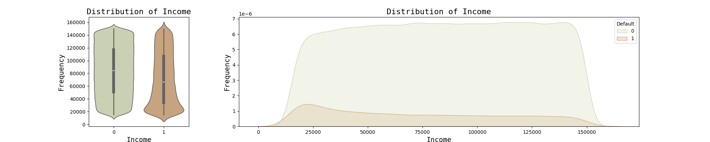

  - Age

    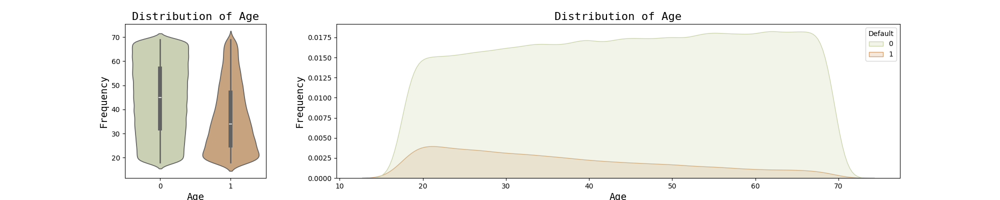
    
  - LoanAmount

    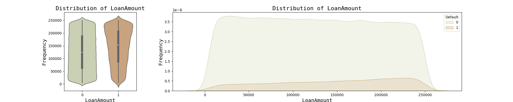

  - InterestRate

    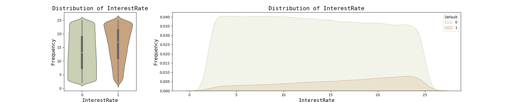

  - CreditScore

    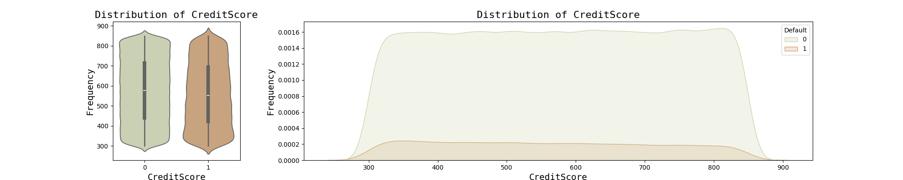

  - **Conclusion**
     1. The Loan defaulters are high where `InterestRate` or `LoanAmount` is High.
     2. Younger people or low income category too had more defaulters.
     3. Credit Score in general did not show any obvious trend.
  
  

## 3. Bivariate Analysis

For Bivariate Analysis, a random sample was picked form "Loan Defaulters" to see if we can see any trend. For This 2 continuous numerical feature were plotted against a category,
1. Scatter Plots also shows the vaiation of CreditScore
2. ScatterPlot and KdePlot filters only Loan defaulters 


__1. Impact of Income on LoanAmount, with Purpose of Loan__
  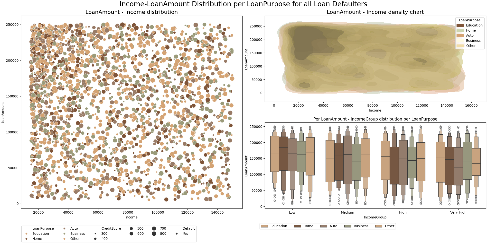

    1. Lower Income Group are the once who have taken Highest Loan.
    2. Highest Loan Defaulters have defaulted in Education, Auto and Business Loan.
    3. Number of loan Taken in each Income group for Each Loan purpose is almost.

  


__2. Impact of InterestRate on LoanAmount, with Purpose of Loan__
  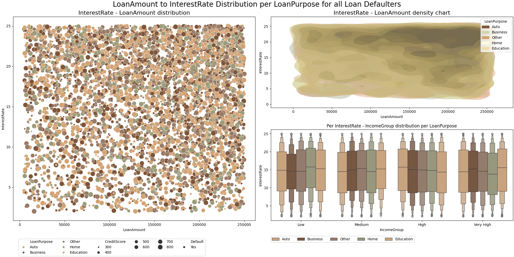

    1. As expected, the High Interest, Higher Amount Loan defaulters are higher.
    2. Highest Loan Defaulters have defaulted in Education, Auto and Business Loan.


__3. Impact of InterestRate on LoanAmount, with AgeGroup__
  For The Purpose of bucketing age, groups age groups between multiples of 5 were grouped togerher as 5-10, 11-15 and so on.

  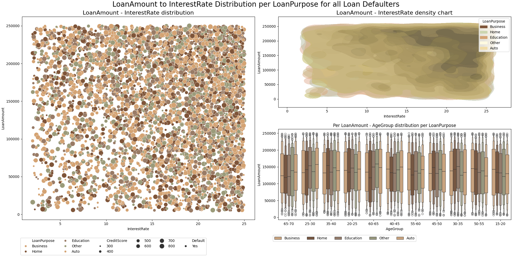

    1. Variation of above, it was seen Younger people have defaulted in Loan most, in all category


## 4. Multivariate Analysis

For Multivariate Analysis, a random sample was picked to see if we can see any trend. For This 1 continuous numerical feature were plotted against 2 categororial features,
1. ViolinPlot plotted, the distribution against Loan defaulters.
2. CountPlot Plotted count in each category
3. HistPlot on right only considered the defaulters and plotted them for each category

__1. Analysis of LoanAmount for each Education category__
  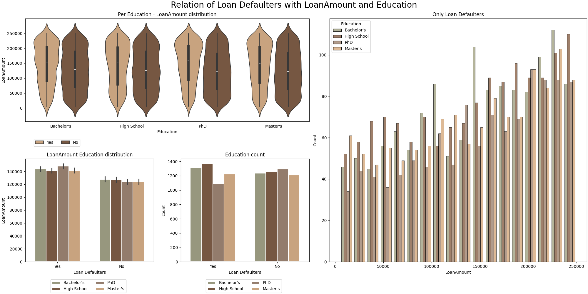

__2. Analysis of LoanAmount for each Employment category__
  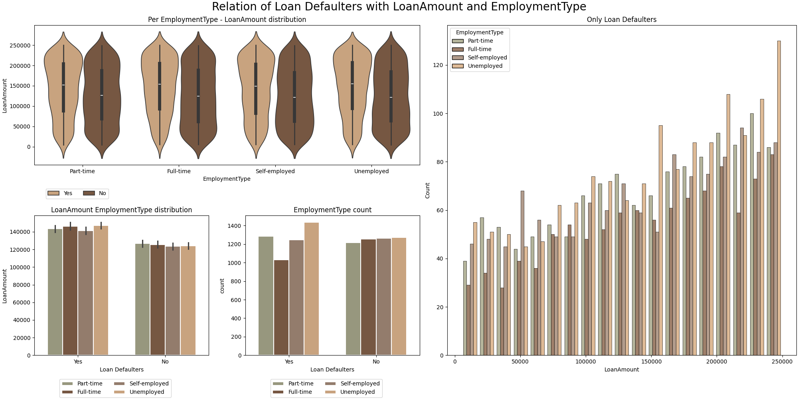

__3. Analysis of LoanAmount for each LoanTerm category__
  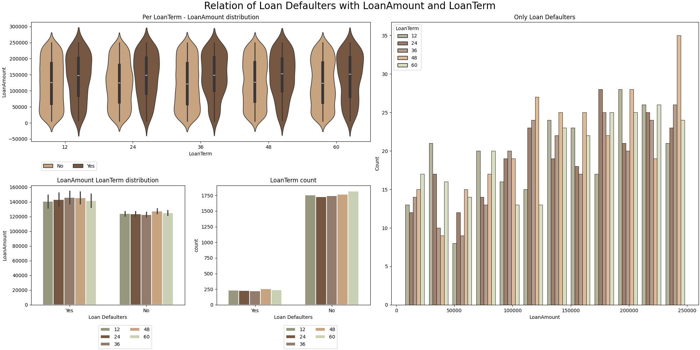

__4. Analysis of LoanAmount for each LoanPurpose category__
  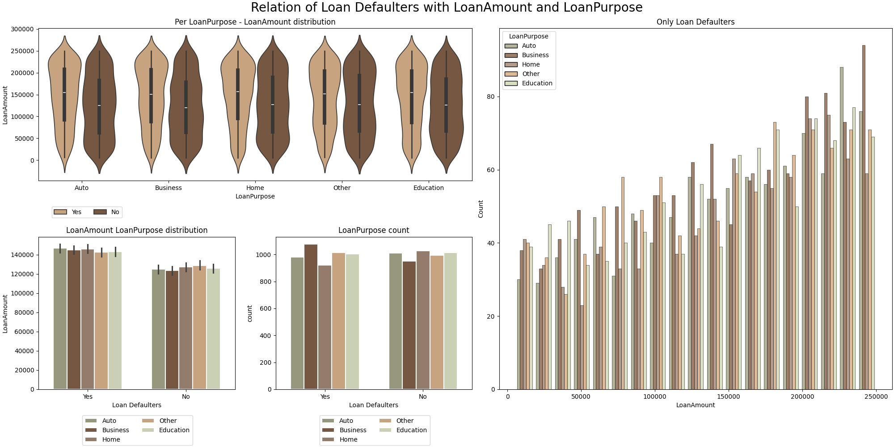

__5. Analysis of LoanAmount for each MaritalStatus category__
  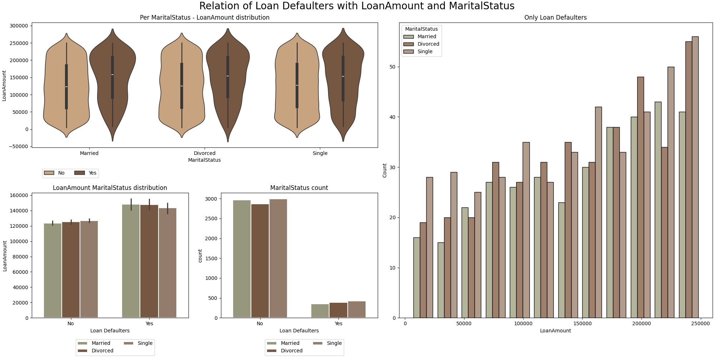

__6. Analysis of LoanAmount for each HasMortgage category__
  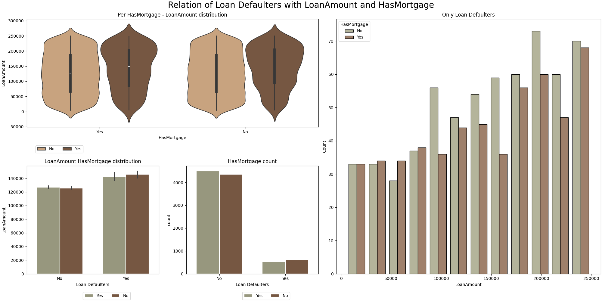

  - **Conclusion**
     1. It was generally seen Loan Defaulters are generally The once who had no previous Mortgage and this trent is seen almost all LoanAmount  range.
     2. Higher Amount of of Loan Defaulters are Singles. Where as `Divorced` are more likely to default on High Amount Loan.
     3. Highest Loan was taken for Business, Defaulters were even spread across all LoanPurpose.
     4. Highest Loan was taken and defaulted on 24 months term. In addition to that. Highest Defaulters wuere is  higher tange across all term.
     
     

## 5. Outliers

- Outliers check was done using Z-Score on 2 fields (1. Income and 2, LoanAmount), both had no Outliers. 
  - Income Range is from 15000.00 to 149999.00
  - Loan Amount if in range 5000.00 to 249999.00
  - Creditscore, MonthsEmployed and LoanTerm all Seem to be in valid Range 

|       |        Age |     Income | LoanAmount | CreditScore | MonthsEmployed | NumCreditLines | InterestRate |   LoanTerm |   DTIRatio | Default    |
| ----: | ---------: | ---------: | ---------: | ----------: | -------------: | -------------: | -----------: | ---------: | ---------: | ---------- |
| count | 255347.000 | 255347.000 | 255347.000 |  255347.000 |     255347.000 |     255347.000 |   255347.000 | 255347.000 | 255347.000 | 255347.000 |
|  mean |     43.498 |  82499.305 | 127578.866 |     574.264 |         59.542 |          2.501 |       13.493 |     36.026 |      0.500 | 0.116      |
|   std |     14.990 |  38963.014 |  70840.706 |     158.904 |         34.643 |          1.117 |        6.636 |     16.969 |      0.231 | 0.320      |
|   min |     18.000 |  15000.000 |   5000.000 |     300.000 |          0.000 |          1.000 |        2.000 |     12.000 |      0.100 | 0.000      |
|   25% |     31.000 |  48825.500 |  66156.000 |     437.000 |         30.000 |          2.000 |        7.770 |     24.000 |      0.300 | 0.000      |
|   50% |     43.000 |  82466.000 | 127556.000 |     574.000 |         60.000 |          2.000 |       13.460 |     36.000 |      0.500 | 0.000      |
|   75% |     56.000 | 116219.000 | 188985.000 |     712.000 |         90.000 |          3.000 |       19.250 |     48.000 |      0.700 | 0.000      |
|   max |     69.000 | 149999.000 | 249999.000 |     849.000 |        119.000 |          4.000 |       25.000 |     60.000 |      0.900 | 1.000      |

---

# Feature Selection

**Notebook**: [02_FeatureSelection.ipynb](02_FeatureSelection.ipynb)

### 1. Categorial 
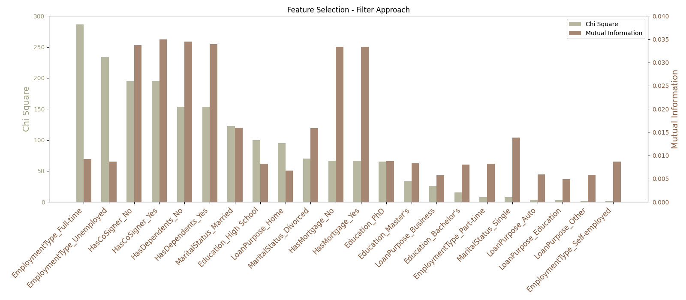

#### Below variables have least impact on target variable. 
These are bottom 30% in both filters
- LoanPurpose (Auto, Education, Others)

#### Highest impact features on target variable, these are top 10 by both filters
- Education (High School, Master's)
- EmploymentType (Full-time)
- HasDependents (Yes, No)
- HasCoSigner (Yes, No)
- HasMortgage (Yes, No)
- MaritalStatus_(Married, Divorced)


### 2. Numerical 

#### Age
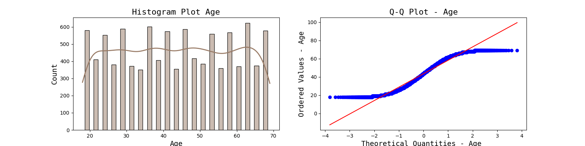

#### Income
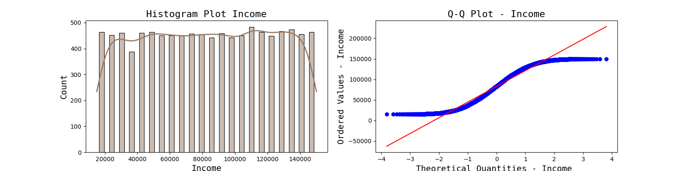

#### InterestRate
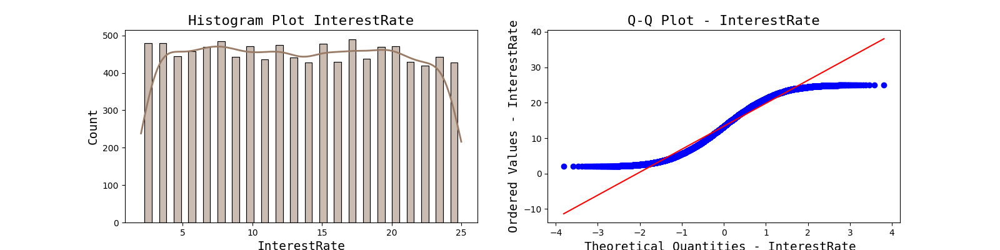

#### LoanAmount
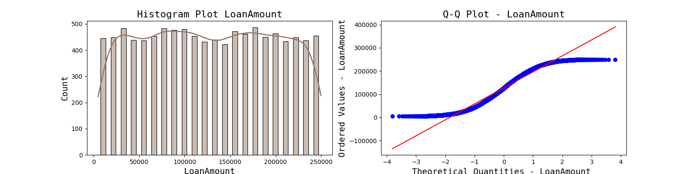

#### MonthsEmployed
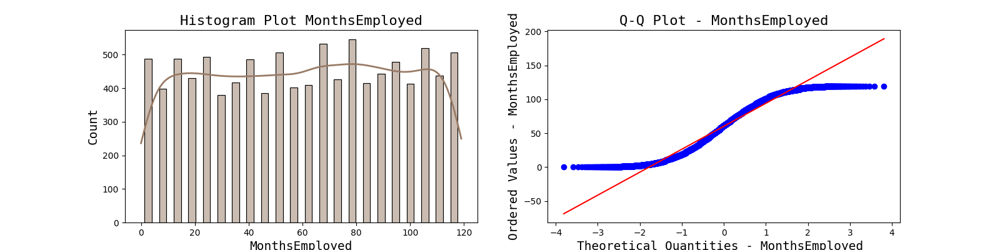

#### DTIRatio
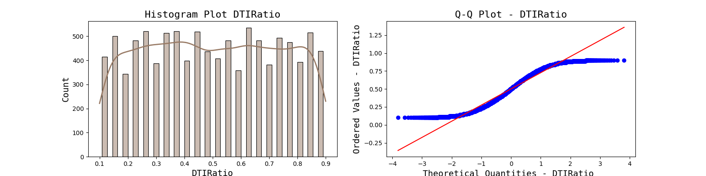

#### Highest impact numerical features on target variable
Using Mutual Information with mutual_info_classif()
- Age, Income, NumCreditLines, InterestRate, LoanTerm are top 5 picks

#### Least impact numerical features on target variable
- DTIRatio and CreditScore are least contributing features

---
# Classification
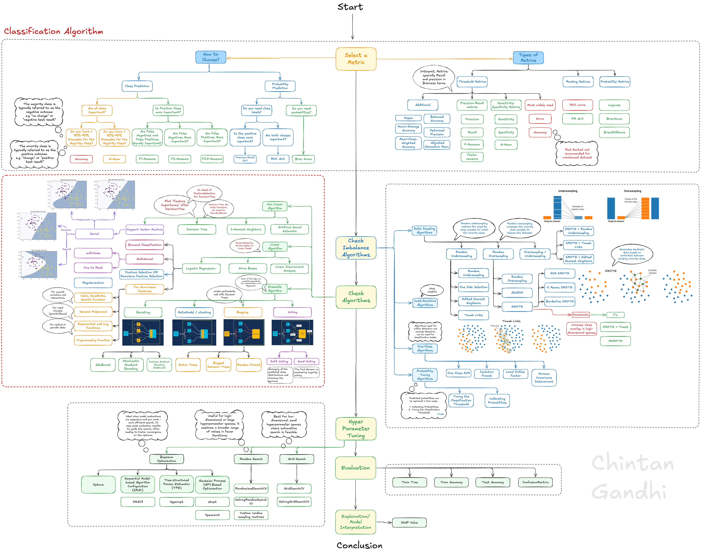

This criterion is linked to a Learning OutcomeModeling:

## 1. Metric 

The choice of metrics depends on what exactly we are trying to answer. As per the problem statement,

> One of the primary objectives of companies with financial loan services is to decrease payment defaults and ensure that individuals are paying back their loans as expected.

The question we, want to answer is 

> How do we predict which individuals are at the highest risk of defaulting on their loans, so that proper interventions can be effectively deployed to the right audience.?

In technical terms we would like to identity majority of our `True Positives` and reduce `False Negative` . 
1. __Recall (Sensitivity)__ is a metric, that measures proportion of correctly predicted positive observations. It answers the question: “**Out of all actual positives, how many did the model capture?**”. 

   $\large Recall\; (Sensitivity)= \Large  \frac{TPs}{(TPs + FNs)}$

   Thus to achieve high `Precision Score` we would to increase True Positives (TP) and recduce False Positive (FP) 

Additionally, we also would like to reduce False Positive, this will make the model more pessimistic and loss of opportunity of more applications are rejected or more resources are wasted if more application are scrutinised.

2. __Precision__ score's focus is **out of the predictions made by the model, what percent is correct>?**

    $\large Precision\; (Sensitivity)= \Large  \frac{TPs}{(TPs + FPs)}$

    Thus, Model should be able to capture majority of `True Positives` and also reduce `False Positives`

Unbalanced dataset particularly are need additional Consideration.  

3. __F1 score__ is essential because it balances precision and recall, providing a single metric that considers both FPs and FNs. 

    $\large F1\; = 2* \Large \frac{Recall\; *\; Precision }{(Recall\; +\; Precision)}$

__Thus to conclude, the 3 Metrics for evaluation will be__
1. Recall (Sensitivity) Score
2. Precision Score
3. F1 Score

---

## Transformers

| Column         | Transformation | Notes                    |
| :------------- | :------------- | :----------------------- |
| Education      | OneHotEncoding |                          |
| EmploymentType | OneHotEncoding |                          |
| MaritalStatus  | OneHotEncoding |                          |
| LoanPurpose    | OneHotEncoding |                          |
| HasMortgage    | OneHotEncoding | Option: `drop=if_binary` |
| HasDependents  | OneHotEncoding | Option: `drop=if_binary` |
| HasCoSigner    | OneHotEncoding | Option: `drop=if_binary` |
| LoanTerm       | OrdinalEncoder |                          |


## Classification Algorithm

Two Algorithms  which will be suitable for to evaluate the model for is
Based on the observation, we had seen, the data is non-linear. Thus first we would like to  

1.  Non-Linear Algorithm
    -  K-Nearest Neighbours
    -  Decision Tree (with/without class weight)

We would also like to give Linear Algirithm a shot, thus

2.  Linear Algorithm 
    -  LogistisRegression with Polynomial Features (with/without class weight)    

If the models are determined to be weak, we will use following Ensemble algorithm

3.  Ensemble Algorithm
    -  Boosting (CatBoostClassifier, XGBClassifier)
    -  Bagging (e.g RandomForestClassifier, BalancedBaggingClassifier)
    -  StackingClassifier and VotingClassifier

4.  Prior to Modeling use __Data Sampling Algorithms__ to balance Dataset
    1. Random under sampling
    2. Random over sampling
    3. Smote,Tomek, SMOTETomek
    4. PolynomialFeatures + PCA

---

# Algorithms
---

## 1. K-Nearest Neighbor	

#### Steps

1. Column Transformation
2. Undersampling the majority class using **`RandomUnderSampler`** 
3. **GridSearchCV + K-Nearest Neighbor**

#### Notebook

- [03_KNN-UnderSampling.ipynb](03_KNN-UnderSampling.ipynb)

#### Scores

| Evaluator         | Score   |
| ----------------- | ------- |
| Training Accuracy | 100.00% |
| Test Accuracy     | 59.89%  |
| Recall Score      | 15.25%  |
| Precision Score   | 25.00%  |
| Accuracy Score    | 84.80%  |
| F1 Score          | 18.95%  |
| ROC AUC Score     | 60.92%  |

#### Custom Threshold

| threshold | recall | precision | f1-score | accuracy |
| :-------- | -----: | --------: | -------: | -------- |
| 0.300     |  0.950 |     0.127 |    0.224 | 0.233    |
| 0.400     |  0.825 |     0.142 |    0.242 | 0.399    |
| 0.500     |  0.623 |     0.169 |    0.266 | 0.599    |
| 0.600     |  0.365 |     0.204 |    0.262 | 0.760    |
| 0.700     |  0.153 |      0.25 |    0.189 | 0.848    |

---


## 2. K-Nearest Neighbor, balance with TomekLinks

#### Steps

1. Column Transformation
2. Using  **`TomekLinks`** to Unbalanced dataset
3. **GridSearchCV + K-Nearest Neighbor**

#### Notebook

- [04_KNN-TomekLinks.ipynb](04_KNN-TomekLinks.ipynb)

#### Scores

| Evaluator         | Score   |
| :---------------- | ------- |
| Training Accuracy | 100.00% |
| Test Accuracy     | 87.92%  |
| Recall Score      | 0.29%   |
| Precision Score   | 46.43%  |
| Accuracy Score    | 88.35%  |
| F1 Score          | 0.58%   |
| ROC AUC Score     | 51.14%  |

#### Custom Threshold

| threshold | recall | precision | f1-score | accuracy |
| :-------- | -----: | --------: | -------: | -------- |
| 0.300     |  0.194 |     0.241 |    0.215 | 0.835    |
| 0.400     |  0.089 |     0.292 |    0.137 | 0.869    |
| 0.500     |  0.032 |     0.316 |    0.058 | 0.879    |
| 0.600     |  0.011 |     0.388 |    0.021 | 0.883    |
| 0.700     |  0.003 |     0.464 |    0.006 | 0.883    |

---


## 3. K-Nearest Neighbor, balance with SMOTE

#### Steps

1. Column Transformation
2. Using  **`SMOTE`** to Unbalanced dataset
3. **GridSearchCV + K-Nearest Neighbor**

#### Notebook

- [05_KNN-SMOTE.ipynb](05_KNN-SMOTE.ipynb)

#### Scores

| Evaluator         | Score   |
| :---------------- | ------- |
| Training Accuracy | 100.00% |
| Test Accuracy     | 87.92%  |
| Recall Score      | 0.29%   |
| Precision Score   | 46.43%  |
| Accuracy Score    | 88.35%  |
| F1 Score          | 0.58%   |
| ROC AUC Score     | 51.14%  |

#### Custom Threshold

| threshold | recall | precision | f1-score | accuracy |
| :-------- | -----: | --------: | -------: | -------- |
| 0.300     |  0.604 |     0.157 |    0.249 | 0.575    |
| 0.400     |  0.495 |     0.165 |    0.248 | 0.649    |
| 0.500     |  0.472 |     0.167 |    0.247 | 0.664    |
| 0.600     |  0.364 |     0.176 |    0.238 | 0.728    |
| 0.700     |  0.330 |     0.182 |    0.234 | 0.749    |

---


## 4. Decision Tree

#### Steps

1. Column Transformation
2. Determine approx range if all parameters for Decision Tree
3. **GridSearchCV + Decision Tree**

#### Notebook

- [06_DecisionTree.ipynb](06_DecisionTree.ipynb)

#### Scores

| Evaluators         | Score  |
| :---------------- | ------ |
| Training Accuracy | 54.25% |
| Test Accuracy     | 54.14% |
| Recall Score      | 41.54% |
| Precision Score   | 25.32% |
| Accuracy Score    | 79.09% |
| F1 Score          | 31.47% |
| ROC AUC Score     | 64.40% |

#### Custom Threshold

| threshold | recall | precision | f1-score | accuracy |
| --------- | :----: | :-------: | :------: | :------: |
| 0.300     | 0.962  |   0.129   |  0.227   |  0.243   |
| 0.400     | 0.838  |   0.155   |  0.261   |  0.452   |
| 0.500     | 0.777  |   0.172   |  0.281   |  0.541   |
| 0.600     | 0.511  |   0.236   |  0.323   |  0.753   |
| 0.700     | 0.415  |   0.253   |  0.315   |  0.791   |

---


## 5 DecisionTree with Pruning and fitting with BayesSearchCV

#### Steps

1. Column Transformation
2. Determine approx range if all parameters for Decision Tree
3. **`Prune`** and **`BayesSearchCV`** with different values of **`ccp_alphas`**

#### Notebook

- [06_DecisionTree.ipynb](06_DecisionTree.ipynb)

#### Scores

| Evaluators       | Score  |
| :---------------- | ------ |
| Training Accuracy | 67.69% |
| Test Accuracy     | 67.01% |
| Recall Score      | 29.17% |
| Precision Score   | 31.49% |
| Accuracy Score    | 84.49% |
| F1 Score          | 30.29% |
| ROC AUC Score     | 66.16% |

#### Custom Threshold

| threshold | recall | precision | f1-score | accuracy |
| --------- | :----: | :-------: | :------: | :------: |
| 0.300     | 0.894  |   0.148   |  0.255   |  0.395   |
| 0.400     | 0.794  |   0.174   |  0.286   |  0.541   |
| 0.500     | 0.651  |   0.206   |  0.313   |  0.670   |
| 0.600     | 0.516  |   0.251   |  0.337   |  0.766   |
| 0.700     | 0.292  |   0.315   |  0.303   |  0.845   |


---

## 6. BalancedRandomForest

#### Steps

1. Column Transformation
2. Determine approx range if all parameters for Decision Tree
3. **GridSearchCV + BalancedRandomForestClassifier**

#### Notebook

- [07_Ensemble_BalancedRandomForest.ipynb](07_Ensemble_BalancedRandomForest.ipynb)

#### Scores

| Evaluators       | Score  |
| :---------------- | ------ |
| Training Accuracy | 64.17% |
| Test Accuracy     | 55.48% |
| Recall Score      | 44.95% |
| Precision Score   | 23.99% |
| Accuracy Score    | 77.19% |
| F1 Score          | 31.28% |
| ROC AUC Score     | 64.71% |

#### Custom Threshold

| threshold | recall | precision | f1-score | accuracy |
| --------- | :----: | :-------: | :------: | :------: |
| 0.300     | 0.939  |   0.137   |  0.239   |  0.311   |
| 0.400     | 0.851  |   0.155   |  0.262   |  0.446   |
| 0.500     | 0.767  |   0.175   |  0.285   |  0.555   |
| 0.600     | 0.605  |   0.206   |  0.308   |  0.685   |
| 0.700     | 0.449  |   0.240   |  0.313   |  0.772   |


---

## 7. CatBoostClassifier

#### Steps

1. Column Transformation
2. **CatBoostClassifier**

#### Notebook

- [08_Ensemble-CatBoost.ipynb](08_Ensemble-CatBoost.ipynb)

#### Scores

|      | Evaluators         | Score  |
| ---: | :---------------- | ------ |
|    0 | Training Accuracy | 65.98% |
|    1 | Test Accuracy     | 65.24% |
|    2 | Recall Score      | 41.36% |
|    3 | Precision Score   | 32.73% |
|    4 | Accuracy Score    | 83.40% |
|    5 | F1 Score          | 36.54% |
|    6 | ROC AUC Score     | 68.51% |

#### Custom Threshold

| threshold | recall | precision | f1-score | accuracy |
| --------- | :----: | :-------: | :------: | :------: |
| 0.300     | 0.927  |   0.149   |  0.257   |  0.380   |
| 0.400     | 0.842  |   0.175   |  0.290   |  0.524   |
| 0.500     | 0.728  |   0.210   |  0.326   |  0.652   |
| 0.600     | 0.585  |   0.257   |  0.357   |  0.757   |
| 0.700     | 0.414  |   0.327   |  0.365   |  0.834   |

---


## 8. CatBoostClassifier, balance with SMOTETomek

#### Steps

1. Column Transformation
2. SMOTETomek to balance the dataset
3. **XGBClassifier**

#### Notebook

- [09_Ensemble-SMOTETomek-CatBoost.ipynb](09_Ensemble-SMOTETomek-CatBoost.ipynb)

#### Scores

| Evaluators         | Score  |
| :---------------- | ------ |
| Training Accuracy | 74.10% |
| Test Accuracy     | 53.73% |
| Recall Score      | 56.73% |
| Precision Score   | 25.73% |
| Accuracy Score    | 76.09% |
| F1 Score          | 35.41% |
| ROC AUC Score     | 66.23% |

#### Custom Threshold

| threshold | recall | precision | f1-score | accuracy |
| --------- | :----: | :-------: | :------: | :------: |
| 0.300     | 0.956  |   0.138   |  0.241   |  0.305   |
| 0.400     | 0.905  |   0.155   |  0.265   |  0.419   |
| 0.500     | 0.825  |   0.177   |  0.292   |  0.537   |
| 0.600     | 0.719  |   0.210   |  0.325   |  0.654   |
| 0.700     | 0.567  |   0.257   |  0.354   |  0.761   |

---


## 9. XGBoost

#### Steps

1. Column Transformation
2. **XGBClassifier**

#### Notebook

- [10_Ensemble-XGBoost.ipynb](10_Ensemble-XGBoost.ipynb)

#### Scores

| Evaluators         | Score  |
| :---------------- | ------ |
| Training Accuracy | 73.94% |
| Test Accuracy     | 70.96% |
| Recall Score      | 33.07% |
| Precision Score   | 33.92% |
| Accuracy Score    | 84.83% |
| F1 Score          | 33.49% |
| ROC AUC Score     | 67.52% |

#### Custom Threshold

| threshold | recall | precision | f1-score | accuracy |
| --------- | :----: | :-------: | :------: | :------: |
| 0.300     | 0.855  |   0.164   |  0.275   |  0.479   |
| 0.400     | 0.748  |   0.191   |  0.304   |  0.605   |
| 0.500     | 0.631  |   0.227   |  0.334   |  0.710   |
| 0.600     | 0.489  |   0.276   |  0.353   |  0.793   |
| 0.700     | 0.331  |   0.339   |  0.335   |  0.848   |

---


## 10. RandomForestClassifier

#### Steps

1. Column Transformation
2. **RandomForestClassifier**

#### Notebook

- [11_Ensemble_RandomForest.ipynb](11_Ensemble_RandomForest.ipynb)

#### Scores

| Evaluator         | Score  |
| :---------------- | ------ |
| Training Accuracy | 66.20% |
| Test Accuracy     | 66.21% |
| Recall Score      | 2.10%  |
| Precision Score   | 63.92% |
| Accuracy Score    | 88.55% |
| F1 Score          | 4.07%  |
| ROC AUC Score     | 66.89% |

#### Custom Threshold

| threshold | recall | precision | f1-score | accuracy |
| --------- | :----: | :-------: | :------: | :------: |
| 0.300     | 0.993  |   0.120   |  0.215   |  0.162   |
| 0.400     | 0.898  |   0.151   |  0.258   |  0.403   |
| 0.500     | 0.678  |   0.207   |  0.317   |  0.662   |
| 0.600     | 0.345  |   0.316   |  0.330   |  0.838   |
| 0.700     | 0.021  |   0.639   |  0.041   |  0.886   |

---


## 11 StackingClassifier

#### Steps

1. Column Transformation
2. Estimators: **BalancedRandomForest**, **CatBoostClassifier**, **RandomForestClassifier**
   1. Final Estimator: **DecisionTree**

#### Notebook

- [12_Ensemble-Stacking-Voting.ipynb](12_Ensemble-Stacking-Voting.ipynb)

#### Scores

| Evaluator         | Score  |
| :---------------- | ------ |
| Training Accuracy | 73.90% |
| Test Accuracy     | 71.98% |
| Recall Score      | 34.14% |
| Precision Score   | 18.85% |
| Accuracy Score    | 75.42% |
| F1 Score          | 24.29% |
| ROC AUC Score     | 58.22% |

#### Custom Threshold

| threshold | recall | precision | f1-score | accuracy |
| --------- | :----: | :-------: | :------: | :------: |
| 0.300     | 0.438  |   0.175   |  0.250   |  0.697   |
| 0.400     | 0.421  |   0.178   |  0.250   |  0.708   |
| 0.500     | 0.403  |   0.181   |  0.250   |  0.720   |
| 0.600     | 0.376  |   0.182   |  0.246   |  0.733   |
| 0.700     | 0.341  |   0.189   |  0.243   |  0.754   |

---


## 12. VotingClassifier

#### Steps

1. Column Transformation
2. Estimators: **BalancedRandomForest**, **CatBoostClassifier**, **RandomForestClassifier**

#### Notebook

- [12_Ensemble-Stacking-Voting.ipynb](12_Ensemble-Stacking-Voting.ipynb)

#### Scores

| Evaluator         | Score  |
| :---------------- | ------ |
| Training Accuracy | 74.83% |
| Test Accuracy     | 68.13% |
| Recall Score      | 67.69% |
| Precision Score   | 21.75% |
| Accuracy Score    | 68.13% |
| F1 Score          | 32.92% |
| ROC AUC Score     | 67.94% |

#### Custom Threshold

| threshold | recall | precision | f1-score | accuracy |
| --------- | :----: | :-------: | :------: | :------: |
| 0.300     | 0.926  |   0.146   |  0.252   |  0.364   |
| 0.400     | 0.816  |   0.176   |  0.289   |  0.536   |
| 0.500     | 0.677  |   0.217   |  0.329   |  0.681   |
| 0.600     | 0.496  |   0.273   |  0.352   |  0.789   |
| 0.700     | 0.298  |   0.361   |  0.327   |  0.858   |

---


## 13. LogisticRegression, with PCA 

#### Steps

1. Column Transformation
2. PCA
3. **LogisticRegression**

#### Notebook

- [13_LogisticRegression-PCA.ipynb](13_LogisticRegression-PCA.ipynb)

#### Scores

|        Evaluator  | Score   |
| ----------------: | ------- |
| Training Accuracy | 88.44%  |
|     Test Accuracy | 88.53%  |
|      Recall Score | 0.03%   |
|   Precision Score | 100.00% |
|    Accuracy Score | 88.45%  |
|          F1 Score | 0.07%   |
|     ROC AUC Score | 51.14%  |

#### Custom Threshold

| threshold | recall | precision | f1-score | accuracy |
| --------- | :----: | :-------: | :------: | :------: |
| 0.300     | 0.209  |   0.404   |  0.275   |  0.873   |
| 0.400     | 0.087  |   0.507   |  0.148   |  0.885   |
| 0.500     | 0.025  |   0.583   |  0.048   |  0.885   |
| 0.600     | 0.004  |   0.667   |  0.009   |  0.885   |
| 0.700     | 0.000  |   1.000   |  0.001   |  0.885   |

---

## 14. LogisticRegression, with SMOTE and FeatureSelection

#### Steps

1. Column Transformation
2. SMOTE
3. FeatureSelection
4. **LogisticRegression**

#### Notebook

- [14_LogisticRegression_SMOTETomek.ipynb](14_LogisticRegression_SMOTETomek.ipynb)

#### Scores

| Evaluator         | Score  |
| :---------------- | ------ |
| Training Accuracy | 70.31% |
| Test Accuracy     | 68.95% |
| Recall Score      | 37.03% |
| Precision Score   | 33.80% |
| Accuracy Score    | 84.35% |
| F1 Score          | 35.34% |
| ROC AUC Score     | 68.74% |

#### Custom Threshold

| threshold | recall | precision | f1-score | accuracy |
| --------- | :----: | :-------: | :------: | :------: |
| 0.300     | 0.887  |   0.160   |  0.271   |  0.449   |
| 0.400     | 0.797  |   0.188   |  0.304   |  0.578   |
| 0.500     | 0.685  |   0.224   |  0.338   |  0.690   |
| 0.600     | 0.539  |   0.269   |  0.359   |  0.778   |
| 0.700     | 0.370  |   0.338   |  0.353   |  0.843   |

---


# Business Recommendation

## For Numerical Features

#### Highest impact numerical features on target variable

Using Mutual Information with mutual_info_classif()

- Age, Income, NumCreditLines, InterestRate, LoanTerm are top 5 picks

#### Least impact numerical features on target variable

- DTIRatio and CreditScore are least contributing features

## For Categorial Features

#### Below variables have least impact on target variable. 

These are bottom 30% in both filters

- LoanPurpose (Auto, Education, Others)

#### Highest impact features on target variable, these are top 10 by both filters

- Education (High School, Master's)
- EmploymentType (Full-time)
- HasDependents (Yes, No)
- HasCoSigner (Yes, No)
- HasMortgage (Yes, No)
- MaritalStatus_(Married, Divorced)

## Proposed Model 

- (Algorithm 12) **VotingClassifier**, 

  - Estimators: **BalancedRandomForest**, **CatBoostClassifier**, **RandomForestClassifier**

  | Score           | ------ |
  | --------------- | ------ |
  | Recall Score    | 67.69% |
  | Precision Score | 21.75% |
  | Accuracy Score  | 68.13% |
  | F1 Score        | 32.92% |
  | ROC AUC Score   | 67.94% |

  <u>This algorithms ensures we are able to catch Defaulters about 68% of times.</u> 


